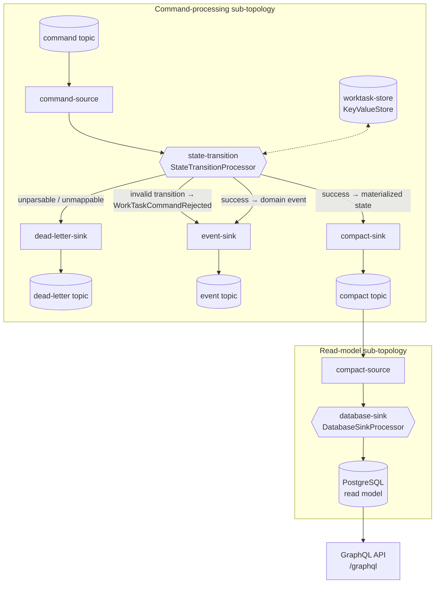

# WorkTask Service

A **Java 25 / Quarkus / Kafka Streams** service for managing Work Tasks,
built using **Event Driven Architecture (EDA)** and **Domain Driven Design
(DDD)**.

External clients drive a `WorkTask` through its lifecycle by sending
commands; the service validates each transition, persists the resulting
state, and publishes domain events and a materialized read-model — all
atomically, via Kafka Streams exactly-once semantics.

The full async API contract is published as an [AsyncAPI](https://www.asyncapi.com/)
specification — see [`src/main/resources/asyncapi.yaml`](src/main/resources/asyncapi.yaml).

## Tech stack

- **Java 25** (openjdk-25)
- **Quarkus 3.36.1** (Gradle Kotlin DSL)
- **Kafka Streams** (low-level `Topology` API, `exactly_once_v2`)
- **Avro** schemas + **Apicurio Schema Registry**
- **PostgreSQL** (read-model persistence via Hibernate ORM with Panache)
- **CloudEvents 1.0** (Kafka Protocol Binding, binary content mode)
- **OpenTelemetry**

## Architecture

### Bounded context & topic naming

Topics follow the convention
`<domain>(.<subdomain>)?.<bounded context>.[public|private].<aggregate>(.<suffix>)?`.
The three operative topics are public (part of the API contract); a fourth,
private topic exists for operational dead-lettering:

| Purpose                | Topic                                              | Suffix    | Retention          |
|------------------------|----------------------------------------------------|-----------|--------------------|
| Inbound commands       | `work.tasks.worktask.public.worktask.command`      | `command` | Delete (short)     |
| Domain events          | `work.tasks.worktask.public.worktask.event`        | `event`   | Delete (long)      |
| Materialized state     | `work.tasks.worktask.public.worktask.compact`      | `compact` | Compact (infinite) |
| Dead letter (internal) | `work.tasks.worktask.private.worktask.dead-letter` | —         | —                  |

### WorkTask domain model

Every `WorkTask` has:

- **`type`** (`WorkTaskType`) — the action to be performed, format
  `<domain>(.<subdomain>)?:<bounded-context>/<task-name>`
  (e.g. `billing.invoices:payment/process-refund`). Immutable.
- **`subject`** (`Subject`) — the aggregate in another bounded context that
  the task acts on: a `SubjectType` (same format as `WorkTaskType`) plus a
  `UUID`. Immutable.
- **`title`** / **`description`** — descriptive text; `description` is optional.
- **`priority`** (`int`) — numeric priority ranking, defaults to `0`. Immutable.
- **`deadline`** (`Instant`, optional) — due-by timestamp. Immutable.

`type`, `subject`, `title`, `description`, `priority`, and `deadline` are all
set at creation time and never change afterward.

### Lifecycle / state machine

Commands drive a state machine. `Reassign` and `Unassign` are special cases
of `Assign` — a single `AssignWorkTask` command with a nullable `assigneeId`
(non-null → `ASSIGNED`, null → `DRAFT`):

| Command                        | Valid from                                   | Resulting state |
|--------------------------------|----------------------------------------------|-----------------|
| Create                         | *(none — initial)*                           | `DRAFT`         |
| Assign (`assigneeId` non-null) | `DRAFT`, `ASSIGNED`, `IN_PROGRESS`, `PAUSED` | `ASSIGNED`      |
| Assign (`assigneeId` null)     | `ASSIGNED`, `IN_PROGRESS`, `PAUSED`          | `DRAFT`         |
| Begin                          | `ASSIGNED`                                   | `IN_PROGRESS`   |
| Pause                          | `IN_PROGRESS`                                | `PAUSED`        |
| Resume                         | `PAUSED`                                     | `IN_PROGRESS`   |
| Complete                       | `IN_PROGRESS`                                | `COMPLETED`     |
| Abort                          | `ASSIGNED`, `IN_PROGRESS`, `PAUSED`          | `ABORTED`       |
| Cancel                         | `DRAFT`, `ASSIGNED`, `IN_PROGRESS`, `PAUSED` | `CANCELLED`     |

`COMPLETED`, `ABORTED`, and `CANCELLED` are terminal. The unified `Assign`
command emits one of three distinct domain events depending on context:
`WorkTaskAssigned` (from `DRAFT`), `WorkTaskReassigned` (from
`ASSIGNED`/`IN_PROGRESS`/`PAUSED` with a non-null assignee), or
`WorkTaskUnassigned` (null assignee).

### Kafka Streams topology



The `event-sink` and `compact-sink` writes for a successful command happen in a
single `exactly_once_v2` transaction.

Implemented in `WorkTaskTopologyProducer` using the low-level `Topology` API
with named sink nodes (`event-sink`, `compact-sink`, `dead-letter-sink`) and
a persistent `KeyValueStore` (`worktask-store`) holding the authoritative
in-flight state. Atomicity between the `event` and `compact` topics is
achieved via `processing.guarantee=exactly_once_v2`. Only genuinely
unparsable (undeserializable) records go to the dead-letter topic — commands
that fail state-transition validation instead produce a
`WorkTaskCommandRejected` event on the event topic.

The `DatabaseSinkProcessor` is a second sub-topology in the same `Topology`:
it consumes the `compact` topic independently (`compact-source`) and
upserts each materialized `WorkTask` into PostgreSQL via
`PanacheWorkTaskRepository`, wrapping each write in its own transaction with
`QuarkusTransaction.requiringNew(...)` (Hibernate ORM needs an active
transaction, and the Kafka Streams processor thread isn't CDI-managed). This
keeps the read model — the table the GraphQL query API reads from — in sync
with the materialized state.

### Query API (GraphQL)

A read-only GraphQL API (`quarkus-smallrye-graphql`) exposes the PostgreSQL
read model at `/graphql` (GraphQL UI at `/q/graphql-ui` in dev mode):

- `workTask(id: ID!): WorkTask` — look up a single WorkTask by id
- `workTasks(filter: WorkTaskFilterInput, page: Int, size: Int): WorkTaskPage`
  — list WorkTasks, optionally filtered (by `status`, `type`, `subjectType`,
  `subjectId`, `assigneeId`) and paged

Implemented in `infrastructure/graphql` (`WorkTaskGraphQLApi` +
GraphQL-facing `dto` records), backed by `WorkTaskQueryService` in the
application layer, which in turn calls the `findAll` query method added to
the `WorkTaskRepository` port.

### CloudEvents binding

All Kafka records on the `event` and `compact` topics use the **CloudEvents
1.0 Kafka Protocol Binding, binary content mode**: the record value is raw
Avro bytes, and every CloudEvents attribute is carried as a `ce_`-prefixed
Kafka header (`ce_specversion`, `ce_type`, `ce_source`, `ce_id`, `ce_time`,
`ce_subject`, `ce_datacontenttype`, `ce_dataschema`, `ce_partitionkey`,
`ce_traceparent`, `ce_tracestate`). Inbound command records carry the same
header set; trace context is extracted and propagated end-to-end. See the
[AsyncAPI spec](src/main/resources/asyncapi.yaml) for the full per-message
contract, including concrete `ce_type` values.

## Implementation notes

### Package structure

```
src/main/java/com/example/worktaskservice/
├── domain/            ← pure domain model, no framework dependencies
│   ├── model/         ← WorkTask, WorkTaskStatus, WorkTaskType, Subject, SubjectType
│   ├── command/       ← command records (mapped from Avro-generated classes)
│   ├── event/         ← domain event records
│   └── exception/
├── application/       ← use-case orchestration (WorkTaskCommandHandler,
│                        WorkTaskQueryService, ports)
└── infrastructure/    ← Quarkus / framework adapters
    ├── kafka/         ← topology (incl. DatabaseSinkProcessor), serde,
    │                    Avro ⇄ domain mappers
    ├── persistence/   ← JPA entity + Panache repository
    ├── graphql/       ← GraphQL query API (WorkTaskGraphQLApi + dto records)
    └── config/        ← topic name configuration
```

### Avro-codegen-first

All Kafka message schemas live as `.avsc` files under `src/main/avro/`
(`commands/`, `events/`, `state/`). Java classes are **generated** from these
schemas at build time by the `quarkus-avro` extension — commands, events, and
state are never hand-written as DTOs; only the pure domain records are.

Type conventions:

| Logical type | Avro encoding                                                                           |
|--------------|-----------------------------------------------------------------------------------------|
| UUID         | `{"type": "fixed", "size": 16, "logicalType": "uuid", "name": "UUID"}` (16-byte binary) |
| Timestamp    | `{"type": "long", "logicalType": "timestamp-nanos"}` (epoch nanoseconds)                |

### Schema Registry

Schemas are registered with an Apicurio Schema Registry. Compatibility mode
differs by message direction:

- **Commands** (consumed by this service): `BACKWARD` — the service must keep
  reading commands written against older schema versions as producers
  upgrade independently.
- **Events & state** (produced by this service): `FORWARD` — downstream
  consumers must keep reading newer schema versions with their older schema,
  since they may upgrade later than this service does.

### Identifiers

WorkTask IDs are **UUID v7** (time-ordered, sortable) and serve as the Kafka
record key (serialized as `String` via `toString()`). Other identifiers
(assignee, correlation, subject) use UUID v4 or v7 as convenient. The domain
model uses `UUID` directly — no wrapper types.

## Developer guide

### Prerequisites

- Java 25 (openjdk-25)
- Docker (for Dev Services — Kafka, PostgreSQL, and an Apicurio Schema
  Registry are auto-provisioned in dev/test mode; no manual Docker Compose
  setup required)

### Build & run

```bash
# Build
./gradlew build

# Run tests
./gradlew test

# Run a single test class
./gradlew test --tests "com.example.worktaskservice.SomeTest"

# Run a single test method
./gradlew test --tests "com.example.worktaskservice.SomeTest.someMethod"

# Start Quarkus dev mode (live reload, Dev UI at http://localhost:8080/q/dev)
./gradlew quarkusDev

# Package as uber-jar
./gradlew quarkusBuild

# Native build (GraalVM required)
./gradlew build -Dquarkus.package.type=native
```

In dev mode, Quarkus Dev Services automatically provisions Kafka, PostgreSQL,
and an Apicurio Schema Registry, and creates the four topics listed above.
Note that changes to Dev Services topic/partition configuration in
`application.properties` require a full restart of `quarkusDev` (not just
live reload), since that configuration is build-time.

### Testing

The domain-layer state machine is exhaustively covered by
[`WorkTaskStateMachineTest`](src/test/java/com/example/worktaskservice/domain/model/WorkTaskStateMachineTest.java)
— 60+ tests covering every valid transition, every invalid-transition
rejection, the three-way `Assign`/`Reassign`/`Unassign` event split, and
shared event-field contracts (`correlationId` propagation, `occurredAt`,
`updatedAt` advancement, `createdAt` immutability). New domain behavior
should follow the same `@Nested`-per-command, `@ParameterizedTest`-over-states
structure.

### Running in Minikube via Skaffold

For a closer-to-production loop than Dev Services — running the service and
all its dependencies as real Kubernetes workloads — use [Skaffold](https://skaffold.dev/)
against a local [Minikube](https://minikube.sigs.k8s.io/) cluster.

#### Prerequisites

- `minikube`, `skaffold`, `helm`, `kubectl`, `docker` (Minikube on the docker
  driver + docker runtime — see the `--container-runtime=docker` note below)
- The `quarkus-container-image-docker` and `quarkus-kubernetes` extensions
  (already declared in `build.gradle.kts`) generate, respectively, a
  `Dockerfile.jvm` (under `src/main/docker/`, hand-maintained — see its header
  comment for the build assumptions) and a Deployment/Service manifest
  (`build/kubernetes/kubernetes.yml`, generated at build time from
  `quarkus.kubernetes.*`/`quarkus.container-image.*` properties)

#### One-time cluster setup

```bash
# --container-runtime=docker is required: Skaffold builds the app image into
# Minikube's own Docker daemon (skaffold.yaml `local.push: false`), so the node's
# runtime must be Docker for the kubelet to see that image. The Minikube default
# (containerd) breaks this — Skaffold's `minikube docker-env` probe fails and any
# image built into Docker is invisible to a containerd kubelet.
minikube start --cpus=4 --memory=8192 --container-runtime=docker

# Strimzi Kafka Operator — installs cluster-scoped CRDs (Kafka, KafkaTopic, ...).
# A one-time step per cluster lifetime; intentionally NOT part of `skaffold dev`
# (re-applying/tearing down CRDs on every iteration is wasteful and racy).
# watchAnyNamespace=true is required: the operator runs in `kafka` but the Kafka
# cluster CR lives in `worktask`, and by default the operator only reconciles its
# own namespace — leaving the CR unreconciled (no bootstrap Service, so the app's
# wait-for-deps init container hangs on "bad address worktask-kafka-kafka-bootstrap").
helm repo add strimzi https://strimzi.io/charts/
helm install strimzi-operator strimzi/strimzi-kafka-operator -n kafka --create-namespace \
  --set watchAnyNamespace=true

kubectl create namespace worktask
```

#### Iterating

```bash
skaffold dev --port-forward
```

This builds the app image against Minikube's own Docker daemon (no registry
push needed), deploys the generated app manifest plus the Strimzi `Kafka`/
`KafkaTopic` custom resources (`k8s/strimzi/`) and the Apicurio Schema Registry
3.x manifest (`k8s/apicurio/apicurio-registry.yaml` — see its header comment for
why a hand-written manifest is used instead of the community Helm chart), and
installs PostgreSQL via the Bitnami Helm chart (`k8s/postgresql/`).
`--port-forward` exposes the app locally; the `portForward` stanza in
`skaffold.yaml` pins it to `http://localhost:8080` (the generated Service uses
port 80, so without the pin Skaffold would assign a random local port). The
dependency Services (Kafka, PostgreSQL, Apicurio) are also forwarded, on
auto-assigned local ports printed in Skaffold's output. `skaffold dev` rebuilds
and redeploys on source changes and streams pod logs.

On a fresh cluster the first `skaffold dev` takes a few minutes: the app's
`wait-for-deps` init container (configured via `quarkus.kubernetes.init-containers`
in `application.properties`) holds startup until Kafka, PostgreSQL, and Apicurio
accept connections, since Kafka Streams and Hibernate both connect eagerly at boot.

The app runs with `QUARKUS_PROFILE=minikube` (set as a Deployment env var by
`quarkus.kubernetes.env.vars.quarkus-profile`), which disables Dev Services
and points Kafka/PostgreSQL/Schema-Registry connections at the in-cluster
Service DNS names — see the `%minikube.*` block in `application.properties`.

#### Smoke-testing

```bash
curl http://localhost:8080/q/health/ready    # expect "status": "UP" — kafka-streams + datasource checks
curl http://localhost:8080/graphql -H 'Content-Type: application/json' \
  -d '{"query":"{ workTasks(page: 0, size: 10) { totalCount items { id } } }"}'
```

A fresh cluster should report `totalCount: 0`. Driving a command through the
full pipeline (`CreateWorkTask` → `WorkTaskCreated` event → compact topic →
read model → GraphQL) requires an Avro+CloudEvents-encoded producer; there is
no existing test helper for this (the test suite persists directly via
`PanacheWorkTaskRepository`, bypassing Kafka) — see `CommandAvroMapper`/
`AvroSerdeFactory`/`CloudEventHeaders` under `infrastructure/kafka/` for the
serialization conventions to reuse in a throwaway producer.

Useful diagnostics:

```bash
kubectl get kafka,kafkatopic -n worktask
kubectl get pods -n worktask
```

#### Tearing down

```bash
skaffold delete             # removes the app, Kafka CRs/topics, and Helm releases
minikube stop               # or: minikube delete
```

The Strimzi operator and its CRDs persist across `skaffold delete` by design
(see the one-time setup note above).

## Project status

Implementation in progress — the core domain model, state machine, Kafka
Streams topology, persistence, and CloudEvents binding are scaffolded and
tested; build and `quarkusDev` run cleanly with all Dev Services healthy.

## License

Licensed under the BSD Zero Clause License — see [LICENSE](LICENSE).
